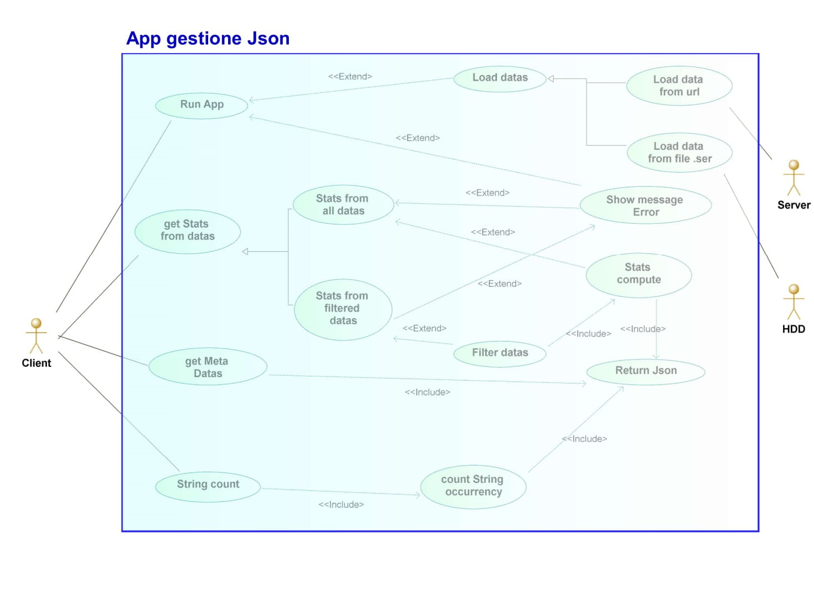
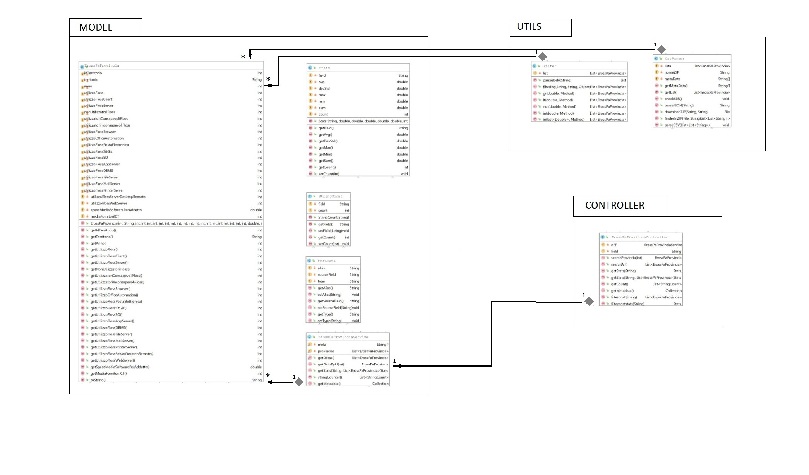
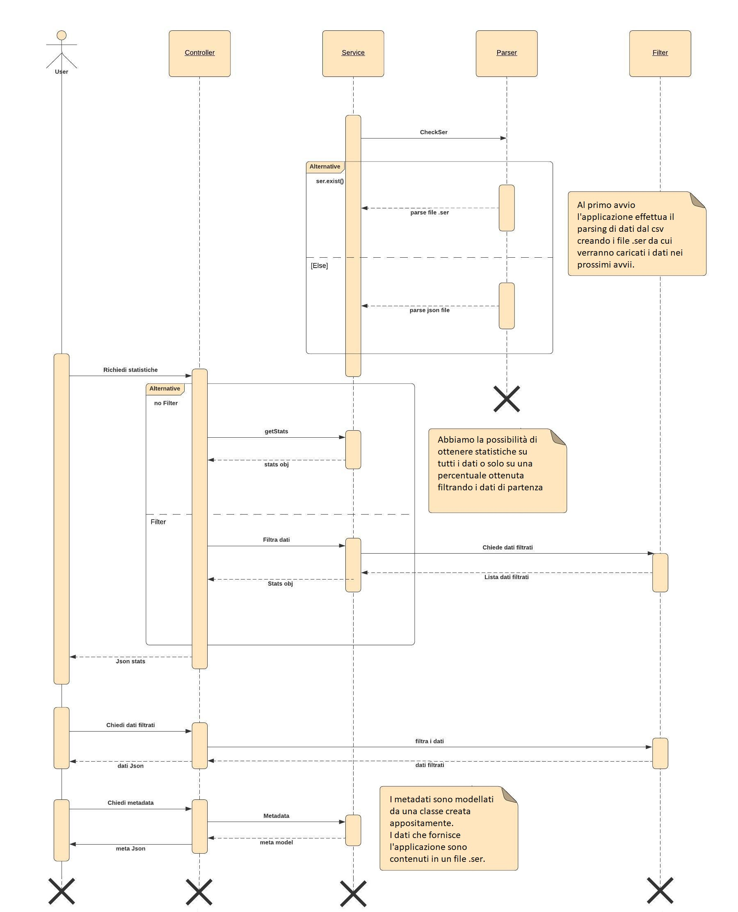

---

---

<h1 id="progetto-programmazione-ad-oggetti">Progetto programmazione ad oggetti</h1>

Progetto per il corso di programmazione ad oggetti del secondo anno di ingegneria informatica e dell&rsquo;automazione (Universit&agrave; politecnica delle Marche).

Studenti: <strong>D'Agostino Lorenzo</strong>, <strong>Giovagnola Massimiliano</strong>.

<h2 id="descrizione">Descrizione</h2>

L&rsquo; applicazione sviluppata consente la gestione di dati formato Json a partire da un file csv. Lapplicazione si occupa di parsare i dati dal file di partenza e, tramite opportune Api rest Get/Post, restituisce in formato Json statistiche ottenute dai dati di partenza o comunque una visualizzazione di dati di interesse.  L&rsquo;applicazione &egrave; sviluppata in java con l&rsquo;utilizzo del framework Spring.

<h2 id="composizione">Composizione</h2>

L&rsquo; applicazione segue il pattern MVC caratteristico del framework utilizzato (Spring), di cui abbiamo implementato il Model ed il Controller. E&rsquo; presente anche un package Utils dove costruiamo le classi esterne al pattern.

<ul>
<li><a href="./src/main/java/com/dagomiliano/progettoesame/model"><strong>Model</strong></a></li>
<li><a href="./src/main/java/com/dagomiliano/progettoesame/controller"><strong>Controller</strong></a></li>
<li><a href="./src/main/java/com/dagomiliano/progettoesame/utils"><strong>Utils</strong></a></li>
</ul>
<h2>Comandi</h2>
<ul>
<li>
<h3>Visualizza informazioni di un record da ID</h3>
<ul>
<li><strong>Sintassi</strong>:&nbsp;<code>/id/{id}</code></li>
<li><strong>Tipo di richiesta</strong>: GET</li>
<li><strong>Descrizione</strong>: Visualizza tutte le informazioni riguardanti un record che possiede l'id specificato dall'utente.</li>
<li><strong>Esempio d'uso</strong>: <code>/id/99&nbsp;</code></li>
</ul>
</li>
</ul>
<ul>
<li>
<h3><strong>Visualizza tutti i record</strong></h3>
<ul>
<li><strong>Sintassi</strong>: <code>/all</code></li>
<li><strong>Tipo di richiesta</strong>: GET</li>
<li><strong>Descrizione</strong>: Visualizza tutte le informazioni di tutti i record presenti.</li>
</ul>
</li>
<li>
<h3>Visualizza statistiche di un determinato campo</h3>
<ul>
<li><strong>Sintassi</strong>: <code>/stats/{field}</code></li>
<li><strong>Tipo di richiesta</strong>: GET</li>
<li><strong>Descrizione</strong>: Visualizza tutte le statistiche di un campo definito dall'utente.</li>
<li><strong>Esempio d'uso</strong>: /stats/idTerritorio</li>
</ul>
</li>
<li>
<h3>Visualizza conteggio elementi unici</h3>
<ul>
<li><strong>Sintassi</strong>: <code>/count</code></li>
<li><strong>Tipo di richiesta</strong>: GET</li>
<li><strong>Descrizione</strong>: Visualizza il numero di occorrenze per ogni elemento di tipo stringa.</li>
</ul>
</li>
<li>
<h3>Visualizza metadata</h3>
<ul>
<li><strong>Sintassi</strong>: <code>/get/metadata</code></li>
<li><strong>Tipo di richiesta</strong>: GET</li>
<li><strong>Descrizione</strong>: Visualizza tutte le informazioni riguardanti i metadati presenti.</li>
</ul>
</li>
<li>
<h3>Visualizza dati filtrati</h3>
<ul>
<li><strong>Sintassi</strong>: <code>/post/filter</code></li>
<li><strong>Tipo di richiesta</strong>: POST</li>
<li><strong>Descrizione</strong>: Visualizza tutte le informazioni dei record che soddisfano una specifica fornita da utente nel body.</li>
</ul>
</li>
<li>
<h3>Visualizza dati statistici dei dati filtrati</h3>
<ul>
<li><strong>Sintassi</strong>: <code>/post/filter/stats</code></li>
<li><strong>Tipo di richiesta</strong>: POST</li>
<li><strong>Descrizione</strong>: Visualizza tutte le statistiche riguardanti i record che soddisfano una specifica fornita da utente nel body.</li>
</ul>
</li>
</ul>
<h2>Filtri</h2>
<table style="height: 97px; width: 705px;">
<tbody>
<tr>
<td style="width: 168px;"><strong>Operatore</strong></td>
<td style="width: 192px;"><strong>Valore di riferimento</strong></td>
<td style="width: 333px;"><strong>Descrizione</strong></td>
</tr>
<tr>
<td style="width: 168px;">$gt</td>
<td style="width: 192px;">Valore</td>
<td style="width: 333px;">Maggiore</td>
</tr>
<tr>
<td style="width: 168px;">$lt</td>
<td style="width: 192px;">Valore</td>
<td style="width: 333px;">Minore</td>
</tr>
<tr>
<td style="width: 168px;">$in</td>
<td style="width: 192px;">Lista di valori</td>
<td style="width: 333px;">Uguale</td>
</tr>
<tr>
<td style="width: 168px;">$not</td>
<td style="width: 192px;">Valori</td>
<td style="width: 333px;">Diverso</td>
</tr>
</tbody>
</table>
<h3>&nbsp;</h3>
<h2>Sintassi body</h2>
<ol>
<li><code>{"{field}" : {"{filter}" : value} </code>  <strong>Esempi</strong>:  <code>{"idTerritorio" : {"$not" : 36}  {"idTerritorio" : {"$lt" : 35}  {"spesaMediaSoftwarePerAddetto" : {"$gt" : 220.2}   </code></li>
<li><code>{"{field}" : {"$in" : [value1,value2,...]} </code>  <strong>Esempi</strong>:  <code>{"idTerritorio" : {"$in" : [99,33,57,150]} </code></li>
</ol>

&nbsp;

<h2 id="diagrammi-uml">Diagrammi UML</h2>

  
